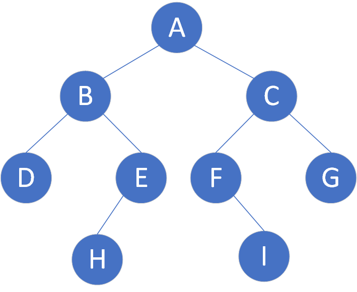

## 一、二叉树的概念

### 1.1 树

> 树是一种数据结构，它是由n（n>=1）个有限节点组成一个具有层次关系的集合。

树的特点：
* 子树不相交
* 除了根节点外，每个结点有一个父结点
* 一个N个结点的树有N-1条边

一些常见术语：
* 结点的度：结点的子树的个数
* 树的度：树的所有结点中的最大度数
* 叶结点：度为0的结点
* 父节点：有子树的结点，是其子树的根结点的父结点
* 子结点：父结点的下一个结点
* 兄弟结点：具有同一父结点的结点

### 1.2 二叉树

> 二叉树是每个节点最多有两个子树（不存在度大于2的结点）的树结构,二叉树的子树有左右之分，次序不能颠倒。它有5种基本形态：二叉树可以是空集；根可以有空的左子树或右子树；或者左右子树皆为空。


二叉树的一些性质：
* 在二叉树中，第 i层上至多有2^(i−1)个节点（i≥1）
* 深度为k的二叉树至多有2^(k−1)个节点（k≥1）
* 对一棵二叉树，如果叶子节点的个数为n0，度为2的节点个数为n2，则n0=n2+1

## 二、二叉树的存储

如图，为一个常见的二叉树结构：


二叉树的存储结构可分为顺序存储和链式存储

### 2.1 顺序存储

> 二叉树的顺序结构就是使用一维数组存储二叉树中的结点，并且结点的存储位置，就是数组的下标索引。

对于上述二叉树，其顺序存储结构如图：


其中，null表示该位置没有存储结点，可以发现，使用顺序存储结构会造成**空间浪费**。

### 2.2 链式存储

一般将二叉树的结点数据结构定义为，分别包含结点的数据以及左右结点(java)：
```
public class TreeNode {
  int val;
  TreeNode left;
  TreeNode right;
  TreeNode(int x) { val = x; }
}
```

## 三、二叉树的遍历

> 二叉树的遍历：从二叉树的根结点出发，按照某种次序依次访问二叉树中的所有结点，使得每一个结点被访问一次，且仅被访问一次。

二叉树的遍历方式主要分为四种：前序遍历、中序遍历、后序遍历、层序遍历

### 3.1 前序遍历(preorder)

> 遍历思想：根结点 ---->  左子树  ---->  右子树

前面二叉树的前序遍历结果： A B D E H C F I G

前序遍历递归:
```
public void preOrderRecursive(TreeNode root) {
    if(root != null) {
        System.out.println(root.val);
        preOrderRecursive(root.left);
        preOrderRecursive(root.right);
    }
}
```

前序遍历非递归：用栈存储右子结点
```
public void preOderNoRecursive(TreeNode root) {
    if (root == null) return;
    Stack<TreeNode> stack = new Stack<>();
    while (root != null || !stack.isEmpty()) {
        while (root != null) {
            System.out.println(root.val);
            stack.push(root);
            root = root.left;
        }
        root = stack.pop();
        root = root.right;
    }
}
```
### 3.2 中序遍历(inorder)

> 遍历思想： 左子树 ----> 根结点 ----> 右子树

上图中序遍历结果： D B H E A F I C G

中序遍历递归版:
```
public void inOderRecursive(TreeNode root) {
    if (root != null) {
        inOderRecursive(root.left);
        System.out.println(root);
        inOderRecursive(root.right);
    }
}
```
中序遍历非递归版：
```
public void inOrderNoRecursive(TreeNode root) {
    if (root == null) return;
    Stack<TreeNode> stack = new Stack<>();
    while (root != null || !stack.isEmpty()) {
        while (root != null) {
            stack.push(root);
            root = root.left;
        }
        root = stack.pop();
        System.out.println(root.val);
        root = root.right;
    }
}
```

### 3.3 后序遍历

> 遍历思想：左子树 ----> 右子树 ----> 根结点

上图后序遍历结果：D H E B I F G C A

后序遍历递归版：
```
public void postOrderRecursive(TreeNode root) {
    if(root != null) {
        postOrderRecursive(root.left);
        postOrderRecursive(root.right);
        System.out.println(root.val);
    }
}
```
后序遍历非递归版：
注意不是前序遍历，和前序遍历也不一样，前序遍历是先在栈中存放right，这样才会先弹出left。后序遍历是先存放left，意味着先弹出right，也即后序遍历的逆序。
```
public void postOrderNoRecursive(TreeNode root) {
    if(root == null) return;
    Stack<TreeNode> s1 = new Stack<>();
    Stack<TreeNode> s2 = new Stack<>();
    s1.push(root);
    while (!s1.isEmpty()) { // 找出后序遍历的逆序存在s2中
        TreeNode node = s1.pop();
        if (node.left != null) s1.push(node.left);
        if (node.right != null) s1.push(node.right);
        s2.push(node);
    }
    while (!s2.isEmpty()) {
        TreeNode node = s2.pop();
        System.out.println(node.val);
    }
}
```

### 3.4 层序遍历

> 层序遍历按照层级结构一层一层的访问每个结点，一般使用队列实现。

上图层序遍历结果： A B C D E F G H I

层序遍历：
```
public void levelTraversal(TreeNode root) {
    Queue<TreeNode> queue = new LinkedList<>();
    queue.add(root);
    while (!queue.isEmpty()) {
        TreeNode cur = queue.poll();
        System.out.println(cur.val);
        if(cur.left != null) queue.add(cur.left);
        if (cur.right != null) queue.add(cur.right);
    }
}
```

### 3.5 深度优先遍历

> 深度遍历其实就是上述的前序、中序、后序。深度优先遍历事实上就是前序遍历。

**总结**: 树的遍历主要有两种，一种是深度优先遍历，像前序、中序、后序；另一种是广度优先遍历，像层次遍历。在树结构中两者的区别还不是非常明显，但从树扩展到有向图，到无向图的时候，深度优先搜索和广度优先搜索的效率和作用还是有很大不同的。 深度优先一般用递归，广度优先一般用队列。一般情况下能用递归实现的算法大部分也能用堆栈来实现。

